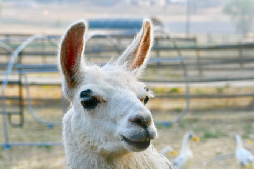
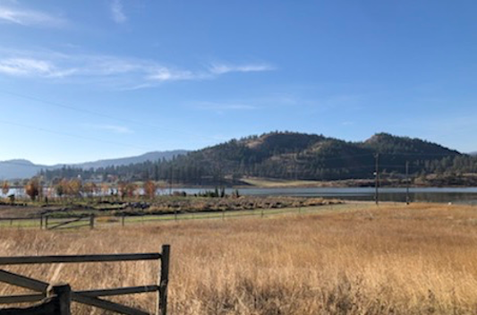

# (PART\*) Lab 1 {-}

# Welcome {-}

*Last updated `r Sys.Date()`*

Welcome to your first Biology 125 Lab for Biology for Science Majors II!

For your first week your TA will spend a bit of time going over the lab schedule and mark breakdown, along with some safety information you will need to work in this space safely and professionally. Your TA will then get you going on your first project!

Your TA will provide you with their contact information along with office hours and location. It is your responsibility to ensure you have this information readily available.

## Your first project {-}

After this brief introduction you will get into pairs - with one group of 3 in uneven class sizes - and your TA will assign you and your partner(s) an environmental problem in which you both will be spending the better part of the term trying to work through.

## But first... {-}

Did you know this little guy is actually real??? Anyone guess what these guys are called?

If you have a guess send me an email at [trisyn.hay@ubc.ca](mailto:trisyn.hay@ubc.ca) or feel free to just say hello.

# Research Project: Part 1 {-}

### Study protocol {-}

This research project will have you looking at specific environmental features - climate, exposure, chemistry - to answer a pretty practical real world problem: will a piece of arable land support the cultivation of a specific crop.

You will be expected to design a study, collect data and report on your findings. You will be recording your data and authoring your report following Open Science best practices, namely, ensuring that your work is transparent, reproducible and well documented.

In this lab, we\'ll be introduced to the problem, explore how to propose a research question to address the issue and scope out a study design that includes what data we\'ll need to collect, how we\'ll organize that data, and how we propose to analyze that data. You\'ll also get things set up to run your first experiment in Lab 3.

Your assignment will be a protocol, detailing the above.

## Meet Elliot {-}

Farmer Elliot is looking to acquire a 20-acre farm to grow mung beans. Farmer Elliot has some basic knowledge of farming as he did some residential gardening in the city and thus understands the basic requirements of plants but has limited knowledge of growing mung beans.

You might be asking why Farmer Elliot is pursuing this when without the needed knowledge ahead of time? Let’s just leave it as Farmer Elliot is a \"act now think later\" kind of person.

## Finding property {-}

In order to start their search Farmer Elliot has enlisted the help of a real-estate company - \"llamaste Realty\". Their real-estate company has shown them three properties thus far.

### Property 1 {-}

This property has 19-acres of flat usable land and is situated next to the base of a large mountain. This land comes with fully automated irrigation and a small one-bedroom home. Though this land is start up ready, Farmer Elliot is concerned that the property may not have enough hours of sunlight due to its proximity to the base of the mountain.

In order to help determine if this is a viable option for their mung bean farm, Farmer Elliot will need to know how many hours of sunlight is required for optimum mung bean germination and growth.

### Property 2 {-}

This property is 21 acres large with 3 acres designated to residential space and the remaining land is usable agricultural acreage. Running parallel to the longest section of this property is a small alkaline lake. Farmer Elliot has been informed that the adjacent alkali lake has, on average, a salinity concentration ranging from 0-5%.

Not knowing if salinity has an impact on germination and growth of munch beans Farmer Elliot is not sure if this is the best property for their endeavor.

### Property 3 {-}

This property is located at a much higher elevation than the other properties and located in a very different biogeoclimatic zone than what Farmer Elliot is familiar with and the differences in mineral content and soil texture in this area results in soil pH levels ranging between 6.2-7.2. It comes with a 2-bedroom home and 20 acres of usable ready to grow acreage.

This property appears ideal but Farmer Elliot is unsure if this pH range is tolerable for mung bean germination and growth.

## Your mission {-}

In order to better inform Farmer Elliot\'s decision they\'ve hired you and your partner(s) as consultants.

Your TA will assign a specific property listing to you and your partner(s) and you will be tasked with designing an experiment to test the specified variable on both mung bean germination and growth.

Following this you will need to develop a recommendation report for your client Farmer Elliot.

To help you in this endeavour, you may wish to review the content from BIOL116 on experimental design – [Designing the Experiment](https://ubco-biology.github.io/BIOL-116-Lab-Manual/designing-the-experiment.html).

# Research Question {-}

First things first, we need a good research question.

In BIOL116 you were introduced to experimental design and hypothesis testing. One of the things we didn\'t touch on in great detail was how to develop a research question.

How you formulate your research question will impact what you study and how you conduct that study.

When we think about transparency and reproducibility in research design and implementation, every step we take and every decision we make is predicated on earlier decisions; and things begin with a research question. Well, to be fair, developing a research question is an iterative process, but it underpins so many future decisions - it will inform your hypothesis – after all, your hypothesis is the testable statement that addresses your research question – which will then inform your study design and so on. So, we shouldn\'t gloss over it\'s importance!

## A good research question {-}

A good research question will help to limit many biases that Open Science is trying to combat in the conduct of research, including HARKing and making decisions after having looked at one\'s data.

A good research question is primarily informed by two things:

* Research done to date that has addressed this problem.
* The problem at hand

## Background {-}

### Consulting the literature {-}

Consulting research done to date will allow you to see how this or similar questions have been addressed by other researchers. Novel ways of addressing the same question are important to move science forward; consulting previous research will help to identify gaps that are opportunities for these novel approaches.

At the same time, consistency in methodology underpins reproducibility, and it\'s consequently just as important to test the same the questions with the same methods in both similar and novel populations as previous research has done, helping to build a body of evidence and identify if earlier findings are generalizable to other populations.

### The problem at hand {-}

The problem at hand will come with certain known and unknown elements. In this assignment, depending on the plot of land that you\'re looking at, you already know certain things about the soil chemistry, geological features or water sources of a given plot.

It is the unknown elements – or a portion of the unknown elements – that your research question will try and address. In this instance, how these factors will impact mung bean production.

A research question that asks

> What is the impact of fertilizer x on the growth of mung beans?

would seem a reasonable first attempt at addressing one potential issue at hand. However, it doesn\'t give a clear definition of what we\'re measuring as either a dependent or independent variable.

Since the research question informs the hypothesis, which then guides your design, you\'re leaving yourself with a lot of wriggle room here further down the line.

## Phrasing {-}

### A testable question {-}

Using the word **what** re-enforces this less than concise formulation of the research question. In fact, predicating your question with **what** or **why** doesn\'t allow your question to ask exactly what you need it to ask.

In experimental design, we\'re testing for relationships - asking \"is there a relationship?\". In fact, we\'re asking a question that allows for the proposal of a hypothesis; a prediction of what that relationship might be. So, we should think about how we can ask a question that reflects the test or experiment we\'re planning.

### A succinct question {-}

In addition to re-framing our question to one which is phrased as a testable question, we want to clearly articulate our population of interest and our main variables of interest. When phrased as

> What is the impact of fertilizer x on the growth of mung beans?

the variables ostensibly include fertilizer and plant growth. But plant growth is more nuanced than this, and our study might be too. In fact, arguably, plant growth is not a variable, but a composite of variables; so, we should ask ourselves, \"what do we mean by growth? What about growth are we interested in? Germination rate, germination survival, biomass, height, flower set, fruit set?\"

Defining the scope of your population and variables is a key consideration when developing a research question; defining these early means that you won\'t be asking these questions later, once you\'ve already started to collect, or work with, your data.

So, ultimately, we want a question that:

* Is testable;
* Clearly identifies our population;
* Clearly identifies our primary variables of interest; and
* Is concise

## An Example {-}

Let\'s say our farmer is concerned primarily about fruit set. It seems reasonable then to test for fruit set. Again, fruit set could be defined in many ways - average biomass per fruit, average count per plant etc. And we may or may not be interested in each of these outcomes. In either case, a more concise, testable research question might then look like

> Will the application of fertilizer x increase the quantity of fruit set of Vigna radiata?

Compare this with what we had before

> What is the impact of fertilizer x on the growth of mung beans?

By specifing a proposed relationship that articulates our variables, not only can we now test this question directly, it identifies exactly what we\'re interested in testing, and it\'s concise, which means that we can then readily propose a hypothesis and null hypothesis to address it:

* Ho: fertilizer x will increase the quantity of fruit set of Vigna radiata.
* Ha: fertilizer x will have no impact on the quantity of fruit set of Vigna radiata.

Reproducibility, meta-analyses, and the evidence base

When we reproduce a study, we always know that there is a chance of error or bias resulting from our sample not being truly representative of its population, for any number of reasons including sampling error, lack of power etc. This is why we should never rely on the findings of just one study.

A meta-analysis is a study of already conducted studies to try and determine if across a series of studies addressing the same research question there is enough agreement in the findings to accept one conclusion, even though this conclusion may be contradicted by individual studies.

Replication enables this aggregation of findings, helping to sift through studies that have suffered from systematic error. To do this well, meta-analyses rely on documentation and homogeneity; studies that use similar methods, instruments, and techniques to address the same question and describe in detail how this was done. This is because comparing two studies of the same phenomenon with two different research questions and two different methodological approaches and data collection tools is extremely confounding and limiting.

Meta-analyses are based on extremely comprehensive literature reviews, reviews that attempt to uncover all literature – published and unpublished – addressing a given research question. Your research question not only informs your hypothesis and study design, it also frames your title and abstract, whether for a lab report, poster, or one day a manuscript. Expressing your research question in a way that clearly and succinctly outlines the variables you plan to test makes the inclusion of your results in a meta-analysis more likely, as your work will be more easily discovered and identified.

In fact, with this in mind, if you were conducting your mung bean research for a particular plot of land in a particular region, this might impact the variables you choose to work with, and you might end up with a still more concise research question that would allow for identification of potential homogeneity and then for comparing your data against other similar studies in a meaningful way. So, for example, in the Okanagan, your research question might be adjusted to

> Will the application of fertilizer x increase the quantity of fruit set of Vigna radiata in a sandy loam soil of the BC Okanagan Valley?

# Research Data Management {-}

Once we know what we want to ask, we need to consider how we\'re going to organize our project and it\'s data. How we do this - Research Data Management or RDM for short - is a critical component of reproducibility and transparency in the sciences.

In BIOL116, you were introduced to best practices in file naming. You may wish to [review that content](https://ubco-biology.github.io/Procedures-and-Guidelines/file-naming.html). In this lab, you\'ll be looking at best practices in directory structure management; that is, how we organize our individual files.

Just like with file naming conventions, it is extremely important that our files are organized in a way that logically reflects the structure of our project and can be easily navigated with computational tools, allowing for, at a minimum, [computational reproducibility](https://ubco-biology.github.io/BIOL-116-Lab-Manual/computational-reproducibility.html). There is also an increased need to provide documentation that describes the chosen structure; in fact, the more complex a project becomes, the more this documentation is important.

So, please review the content on [directory structure management](https://ubco-biology.github.io/Procedures-and-Guidelines/directory-structures.html) in the BIOL Procedures and Guidelines.

# Assignment: Lab 1 {-}

Please use the following template for this assignment:

[20220101_Lab01_125_Protocol-Assignment_V2.docx](files/20220101_Lab01_125_Protocol-Assignment_V2.docx) (17 KB)

### Putting it into practice {-}

Drawing on what you learned in BIOL116 and after reviewing the content for this lab, this assignment asks you to articulate the key components of a protocol: a research question, hypothesis, and proposed study time line, as well as to describe the kind of data (variables as well as data types)  you\'ll be collecting, how you\'ll be collecting it, and what you\'ll be doing with these data.

