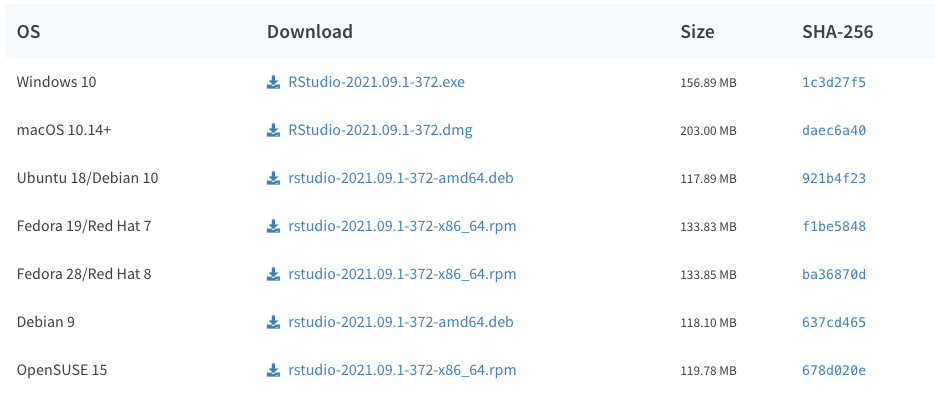
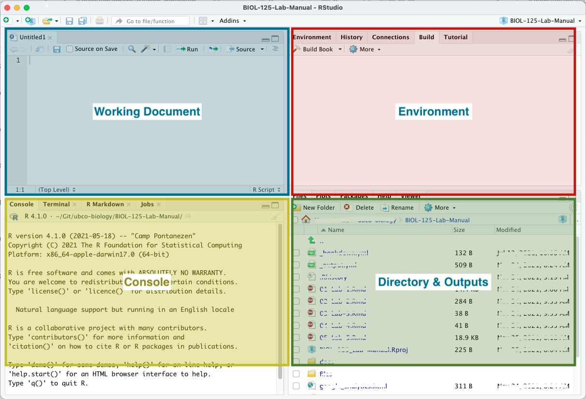

# (PART\*) Lab 5 {-}

# Research Project: Part 4 {-}

*Last updated `r Sys.Date()`*

### Bringing things together {-}

At this stage, you\'ve drafted a protocol, set up your experiment, collected some data, and analyzed that data. Now it\'s time to communicate your findings.

# Recommendation Report {-}

[In lab 1 you were introduced to Markdown](https://ubco-biology.github.io/Procedures-and-Guidelines/readme-files-and-data-dictionaries.html#markdown) in the context of documenting your project with `readmes` and `data-dictionaries`.

The basic syntax used in Markdown can be found in the [BIOL Procedures and Guidelines](https://ubco-biology.github.io/Procedures-and-Guidelines/markdown-1.html). In the Procedures and Guidelines you are introduced to generic text editors for writing Markdown.

Markdown is a powerful authoring tool. Part of what makes it powerful is it\'s integration with other tools, such as <a href="https://ubco-biology.github.io/Procedures-and-Guidelines/glossary#R">`R`</a>. in BIOL202 you will be introduced to statistical analyses using `R`. You will also be asked to author reports using `R` and RMarkdown - [RMarkdown is one flavour of Markdown](https://ubco-biology.github.io/Procedures-and-Guidelines/markdown-flavours.html). Remember, the content that you\'re reading right now is all authored using `R` - when there\'s analyses being presented - and RMarkdown.

For this assignment, you will be learning RMarkdown and the environment in which we author `R` and RMarkdown documents - RStudio. You will not be expected to do your analysis in `R`.

<div class = "note">
Your Recommendation Report Draft will be submitted as both an RMarkdown document and a pdf. You will also need to include a copy of your data in long format saved as <a href="https://ubco-biology.github.io/Procedures-and-Guidelines/glossary#Comma-separated-values-(CSV)-file">`.csv`</a> and a `_DATA-DICTIONARY.md` file. More details on this in the following sections.

While your Recommendation Report Draft should be approximately 5 double-spaced pages, Times New Roman and font size 12, if you\'re using RStudio and the templates provided in this class, you should only have to concern yourself with the length of your report; the rest of the formatting will be handled when you export from RMarkdown to pdf.
</div> 

## Science writing {-}

Technical science writing is an art. Unlike English style writing, technical science is clear-cut and lacking in artistic enhancements.

Do not quote your sources but rather read through the information and write it in your own words and cite it. It is a good idea to read an article once all the way through without making any notes. Then come back and read it again this time making notes in the margins or on some scrap paper. This will help ensure you not only understand the material you are reading but that you are able to describe it in your own words and avoid issues of plagiarism which so often become in issue for students.

You may wish to review the BIOL Procedures and Guidelins content on [APA Citations](https://ubco-biology.github.io/Procedures-and-Guidelines/apa-citations.html) and [Academic Integrity](https://ubco-biology.github.io/Procedures-and-Guidelines/academic-integrity.html).

## Preparing to write {-}

Read a lot! It is important that you have a thorough understanding of the topic. At the very least you should have at least 3 primary source papers you are referring too throughout your report to provide further credibility to your recommendation.

Start writing early! Students often make the mistake of starting the night before the lab report is due. This more often than not results in poor submissions and thus lower grades. You should expect that you will have at least 3 rounds of revisions before you submit.

Someone reading your report should be able to tell what question(s) you addressed, why the topic is important, how you tackled the problem, the types of data you will collect, and how your research helps to inform your client.

<div class = "note">
Need help?

Book an appointment with the the [Student Learning Hub's writing consultants](https://students.ok.ubc.ca/academic-success/learning-hub/writing-language/)!
</div>

## A good report {-}

A good report includes the following headings / sections

* Abstract
* Data availability statement
* Introduction
* Methods
* Results
* Discussion / Conclusion / Recommendations
* References

<div class = "note">
The goal is to clearly describe to Farmer Elliot what your question was, how you went about answering it, what your results told you and what recommendations you have to help Farmer Elliot make his decision.
</div>

### Abstract {-}

An abstract is a brief summary of what the report is all about.

Abstracts in the sciences are approached in a couple of different ways, depending on the sub-discipline and journal preferences. For BIOL125, your abstract should be a single paragraph and no more than 250 words. It should clearly outline the question or problem your research is investigating, describe how the question or problem was addressed and identify the key results and recommendations.

<div class = "takeAway">
In less than 250 words, the reader should be able to attain the most crucial aspects of each segment of the report within this one paragraph.
</div>

### Data availablity statement {-}

As we learned in BIOL116, when appropriate and feasible, the data underlying our analyses should be made available. You will be asked to submit a `.csv` file of your data in long format. You may wish to review the content from BIOL116 on [Preparing Your Data](https://ubco-biology.github.io/BIOL-116-Lab-Manual/preparing-your-data.html) and the content on [Tidy Data](https://ubco-biology.github.io/Procedures-and-Guidelines/tidy-data.html) from the BIOL Procedures and Guidelines. You will also be asked to submit a `_DATA-DICTIONARY.md` file describing your data. Refer back to the [Data Dictionary](https://ubco-biology.github.io/Procedures-and-Guidelines/data-dictionary.html) section of the BIOL Procedures and Guildelines for guidance and an example.

<div class = "takeAway">
This is a short statement that indicates if data is available and if it is, how it can be acquired.
</div>

### Introduction {-}

~ 1 page

The introduction should begin with the general topic and then narrow the focus of the details pertinent to the research.

Your introduction should discuss what is currently understood about the topic and how this ties into the study. This is where you want to get across the interesting points of the field that led you to develop your hypothesis and your experimental design. You want to use many sources, particularly primary sources such as journal articles. Ensure your information is cited appropriately (see guidance in the [BIOL Procedures and Guidelines](https://ubco-biology.github.io/Procedures-and-Guidelines/apa-citations.html)). You should have a clear hypothesis stated at the end of this section. This section will be the lengthiest section of your report. Ensure you reader has no doubt where the source of your information comes from.

<div class = "takeAway">
Your introduction should situate, explain, and identify your research project. It should do this by providing relevant background information that frames the current project and is directly relevant. It should then identify the importance of this particular project. And finally it should clearly articulate the research question and hypothesis being addressed.
</div>

### Methods {-}

~ 1/2 - 1 page

This section of your report involves producing a written description of the materials used and the methods involved in performing your experiment. Under no circumstances should you provide bullet points or list one by one the materials used. Rather you need to describe each step clearly enough that someone else could replicate your experiment exactly. You should also include a section outlining what statistical measure(s) you used and how you transformed your data if need be.

It is highly recommended you show this to someone not in your class and see if they can follow along. If they can\'t you need to ask them where they get stuck and re-write to make sure it\'s clear. Think of this like following a recipe while cooking. Don\'t leave anything out that isn\'t obvious or the recipe will fail for the next person trying to cook.

<div class = "takeAway">
Remember, for transparency and reproducibility, your methods are key to your audience understanding how you did exactly what you did. And if you wrote a protocol, it is the methods section against which that protocol will be screened to identify bias.

So, it should be clear, concise, and contain sufficient information for someone else to reproduce the experiment. This means it should include things like, how specimens were procured, how data was collected (tools, measurements etc), and how the data was analysed.

The steps should flow logically, and, while being concise, you should not use bullet points.
</div>

### Results {-}

~ 1/2 - 1 page

The results section is where you will describe what you saw. That is, what the response was to your variable. This should be the driest and easiest section to write as you are just stating what you found and nothing more. There should be no mention of what you did to attain this data or how you went about doing it - that\'s for your methods section. This is not where you describe why you saw what you saw - that\'s for your discussion and recommendations section. Nor is it where you try and tie in other research to your research - that\'s for your introduction and discussion sections.

The results section should include all averaged data from observations during your experiment. This includes charts, tables, graphs, and any other illustrations of data you feel best represents the information you would like to convey. It should not include any raw data. <a href="https://ubco-biology.github.io/Procedures-and-Guidelines/glossary#Raw-data">Raw data</a> should be attached as a separate file.

Depending on the information you wish to convey you may feel that a box plot, bar graph or line graph is most descriptive. Whichever way you decide think about what message you are trying to convey and ask yourself if an audience was to quickly look at your graph would they get that messaging easily. If not, you should look at an alternative way to display your graph. Your TA will be able to help you sort this out as well. 

Be sure to provide all labels, legends and axes where necessary and a caption which informs the reader of what they are looking at. Remember anyone who is not familiar with your research should be able to quickly look at your figure and understand what message you are trying to show. Please review the BIOL Procedures and Guidelines section on [Figures & Tables](https://ubco-biology.github.io/Procedures-and-Guidelines/figures-tables.html).

<div class = "takeAway">
Your results section should clearly outline the relevant findings from your study and should flow directly from your research question and hypothesis.

This section should include graphs or figures to highlight key findings. Graphs and figures should be present immediately following paragraphs describing the results described by these graphs and figures.

While summary data should be provided, raw data should be not; raw data should be included as supplementary content.
</div>

### Discussion, Conclusions & Recommendations {-}

~ 1 page

This section is where you will discuss what you saw. Were you able to answer the question you set out to answer? Why or why not? In either case try and explain and interpret your results.

This is where you will want to go back to the journals you found and see what they found. Is it similar or not? Why or why not? Did they do something different from you? You can often explain results you may not have anticipated seeing by looking at what others in the area have found. Think about the why?

Is this the right property for Farmer Elliot or should he keep looking?

<div class = "takeAway">
Your job here is to try and explain what you found and how it relates to what others have found. From here you will make your recommendation to your client.
</div>

### References {-}

All references used should be included at the end of your report on a separate page. That includes any books, articles, lab manuals, etc. that you used when writing your report. APA citations are required. Ensure you provide a properly formatted list with sufficient references. At least 3 primary source papers should be listed.

<div class = "takeAway">
For formatting guidance, refer to the [APA section](https://ubco-biology.github.io/Procedures-and-Guidelines/apa-citations.html) of the BIOL Procedures and Guidelines.
</div>

## RMarkdown and RStudio {-}

When you\'re writing `readme` files and `data-dictionaries` - or even taking notes in class - a text editor like VS Code is extremely convenient and versatile. When it comes to authoring reports, however, we\'re going to move you into RStudio.

RStudio is an IDE - an Integrated Development Environment - for `R`. This is just a fancy way of saying that it\'s an application that helps you write `R` code. In BIOL202 and BIOL228, you\'ll start using RStudio to do analyses in `R`. Right now, we\'re just using RStudio to write in RMarkdown and to get used to using the RStudio environment. Along the way, we'll see some `R` code as we get things set up.

Since RStudio is designed for working with `R`, we need to install both `R` and Rstudio. So let\'s do this.

<div class = "note">
If you\'re running a Chromebook, using a tablet, or don\'t want to install anything new on your computer, all of the Windows computers in the library have `R` and RStudio installed on them.

While the `tinytex` package is installed on these machines, it\'s not loaded out of the box. So, you will need to run the following code in the console

```
tinytex::install_tinytex()
```

If prompted to update the `rmarkdown` package, do so. There are more details on `tinytex` and `rmarkdown` in the \'Getting set up\' section below.
</div>

### Installing `R` {-}

`R` is available from CRAN - the Comprehensive R Archive Network - and is available for all operating systems. Find and download the installer for your operating system at [https://cran.r-project.org/](https://cran.r-project.org/). At the time of writing, the latest version is 4.1.2 Any version that is 4.x.x should be fine for what we\'ll be doing.


### Installing RStudio {-}

Once you have `R` installed, you can go ahead and install RStudio, also available for all operating systems. Find and download the installer for your operating system at [https://www.rstudio.com/products/rstudio/download/#download](https://www.rstudio.com/products/rstudio/download/#download). At the time of writing, the latest version is 2021.09.0+351 This or any later version that is published should be fine for what we'll be doing.



### A quick intro to RStudio {-}

Your RStudio window is comprised of 4 panes.

* The upper left is where you'll find your working documents.
* The lower left is your console. It is in the console that we can run `R` code directly if needed.
* The upper right displays information related to your working environment.
* The lower right is where you'll see any output generated by your `R` code, like figures, help pages etc. It's also where you'll see a file manager so that you can interact with your files directly from within RStudio.



For report authoring using RMarkdown, we\'ll mostly be concerned with the upper left pane. We\'ll occasionally use the console to run a bit of `R`. And we\'ll occasionally use the file manager to access files. We won\'t worry at all about the upper right pane - this will have more relevance when you start computing statistics in `R` using RStudio.

<div class = "note">
When you launch RStudio, unless you\'re opening an existing document, you will only see 3 panes, your console will be on the left, and your environment and output panes will be on the right. 
</div>

### Getting set up {-}

Being able to convert from markdown to pdf is not something we can do with the default install of `R`. We need to get two add-ons to be able to do this. Add-ons in `R` are called `packages`.  The first package we need to install is `rmarkdown`. The second is `tinytex`. `rmarkdown` handles the general process of reading through your report and getting it ready to be output to a different format. `tinytex` contains the necessary information to produce a `pdf`, so `rmarkdown` will use `tinytex` for that one part of the conversion process.

<div class = "note">
The `x` in `tinytex` is pronounced like a `k`, so should read more like `tinytek` or `tinytech`.
</div>

#### Installing `Rmarkdown` {-}

Open RStudio, in the console type the following and hit \'Enter\'.

```
install.packages("rmarkdown")
```

You\'ll see a bunch of stuff written to the console. When it\'s all done, you\'ll see your prompt - `>` - return.


#### Installing `tinytex` {-}

Now, in the console type the following and hit \'Enter\' again.

```
install.packages("tinytex")
```
When that\'s all done, type the following and hit \'Enter\'

```
tinytex::install_tinytex()
```

That\'s it. You should be good to go to open the `.Rmd` template available in the Assignment tab for this lab.


# Rubric: Lab 5 {-}

| Criteria | Description | Pts |
| :--- | :--- | ---: |
| Abstract  | Brief, no more than 250 words. Clearly outlines the question / problem. Clearly describes how the question/problem was addressed. Results and recommendations are provided. | 4 |
| Data Availability | Data availability statement is present. | 1 |
| Introduction | Relevant background information provided. Clearly articulates how the background information is connected to the current project. Importance of this project has been described. Written well and easy to follow. Flows from more general and broad background information to the focus of the project. Hypothesis and questions posed are outlined at the end of this section. No factual errors are present. | 7 |
| Methods | No bullet points. All methods and materials are clearly described. Easy to follow. Enough information has been provided for others to be able to reproduce the experiment. Data analysis procedure is also included. | 4 |
| Experimental Design | Procedure is specific and addresses the question / problem. Data collection is clearly defined. Appropriate control (where applicable) has been used. Independent and dependent variables are identified. Student testing only one variable. | 5 |
| Results | Includes graphs / figures. No raw data is provided outside of supplemental. Clearly outlines the findings from the study. Flow is sensible with figures present immediately following paragraphs describing the results of figure. | 4 |
| Figures | Are present. Figure selected is best for this type of data. All axes are labelled with units present where applicable and legends found. All figure present have been discussed in write up. Only averages are being shown. Appropriate statistical measures are present. Figures are clear and easy to interpret. No figures present without being discussed. | 7 |
| Discussion & Recommendation | Student displays clear understanding of results. Student displays a clear understanding of the meaning of these results. Interpretation of results is founded in the data, observations and/or other studies. Recommendations are sound and based on the current study and / or other studies. | 4 |
| Spelling & Grammar  | No spelling errors. No grammar errors. No awkward sentence structures. | 3 |
| References & in-text citations | APA format used properly and consistently. Minimum of 3 primary source papers used in the report. In-text citations are used when required. Citations and references match up. | 4 |
| Plagiarism & Quotations | No plagiarism of any kind has been found. No quotations present. Information attained from outside resources are properly cited. | 3 |
| File Uploads & Format | A total of 4 files have been submitted. Report has been submitted as `pdf` and RMarkdown. Report is no more than 5 pages (excluding references). Data has been submitted in Tidy format as `csv`. Data dictionary has been submitted as `.md`. | 4 |
| **Total** |  | **50** |

# Assignment: Lab 5 {-}

Please use the following template for this assignment:

[20220101_Lab05_125_Assignment_V1.Rmd](files/report/20220101_Lab05_125_Assignment_V1.Rmd) (3 KB)

<div class = "flag">
You will need to submit 4 files for this assignment:

* Recommendation report as `.Rmd`
* Recommendation report as `.pdf`
* Data in <a href="https://ubco-biology.github.io/Procedures-and-Guidelines/glossary#Long-format-data">long</a>, tidy, format as `.csv`
* Data dictionary as `.md`
</div>

You will receive your marked lab report one week from the time it is submitted.

You can decide to resubmit the same lab report draft without making any changes or you will have the opportunity to review the edits and make the needed changes in order to increase your mark.

If you have any questions regarding your mark and / or the comments from your TA please ensure you take the opportunity to chat with your TA to go over these. This will ensure that you are in the best position to attain the highest marks possible for this assignment.

### Using the template {-}

<div class = "note">
All the markdown syntax that you need for RMarkdown can be found in the [Markdown](https://ubco-biology.github.io/Procedures-and-Guidelines/markdown-1.html) section of the BIOL Procedures and Guidelines.
</div>

### Directory structure & file naming {-}

It is expected that you will have a root project folder for your work associated with this lab. And that at the minimum you will have a folder for your report, your data, and your figures. And that you will download this template into your `report/` directory. And that lastly, you will rename the template in accordance with the file naming convention you outlined in your first assignment.

This structure and hierarchy will be important when it comes time to include figures and images in your report.

### YAML {-}

The top of the template contains some front matter called YAML. YAML provides instructions to all the pieces of software involved in converting your RMarkdown document to it\'s outputs, in this case, `pdf`. YAML is very specific to spacing, so don\'t add any extra spaces!

What you need to do.

1. Provide a title within the quotations after `title`.
2. Provide your name within the quotations after `author`.
3. Provide your abstract within the quotations after `abstract`.

What might be nice to know.

1. <code>r Sys.Date()</code> pulls the date from your computer and auto populates this for you.
2. The `output` tag defines the output format. Other options include `html_document` and `word_document`.

<div class = "advanced">
What exactly is YAML?

> YAML™ (rhymes with “camel”) is a human-friendly, cross language, Unicode based data serialization language designed around the common native data types of dynamic programming languages. It is broadly useful for programming needs ranging from configuration files to internet messaging to object persistence to data auditing and visualization.

Read more at [the Official YAML Web Site](https://yaml.org/)
</div>

### Document body {-}

The template is then pre-populated with first level headers for each section you\'re expected to include in your report. Each heading re-iterates the key elements the content of these headings should address. This is just place holder text, so replace it with your own.

### Images & graphs {-}

There is one sample graph included. Note how it references the figure to be included `../figures/image-name.png` The `../` means \'go one level up in the directory\' which, if you have your project set up in the following way and your `.Rmd` file is in your `report/` directory it means \'look in the `root/` directory for a folder called `figures/`.

```
root/
  report/20220101_Lab05_125_Assignment_V1.Rmd
  data/
  figures/MVD_BIOL125-Lab5_Fig-1-Boxplot_V1.png
```

If you make a mistake in setting this path, you\'ll get the following error in RStudio

```
(No image at path ...)
```

You'll also note the following directly after the image path: `{width=50%}`. This reduces the image size by 50%. This works well for the images produced by the ShinyApp used in this course.

As noted in the template, you do not need to write `Figure 1:` before your figures; this small piece of text is handled during the conversion from RMarkdown to pdf. Any other information that you would like to include in the caption should go in the `[]` before the `()` that contain the path to the image.

<div class = "note">
Figure placement

The engine behind the conversion from RMarkdown to pdf is a typesetting application, one with pretty strict rules about how content should be formatted - much more strict than something like Microsoft Word.

What this means is that if the placement of your images will disrupt your prose - by creating large amounts of empty white space for example - this typesetting application will *push* your figure to somewhere lower in your report where it won\'t create this white space.

Your figures should be adjacent to the relevant text in your RMarkdown file. How this manifests to your pdf might look a little different; that\'s ok.
</div>

### References {-}

Just before the heading for references you\'ll see the following

```
\clearpage
```

This creates a page break between your references section and the rest of your report.

### Building the `pdf` {-}

If you've installed `R`, RStudio, and the `markdown` and `tinytex` packages succesfully, when you open the template `.Rmd` file you should see an option to `Knit`.


Click this button or select the drop down arrow and select `Knit to pdf`. This will generate a pdf in the same directory as your `.Rmd` file.

To test this with the template, ensure the template `.Rmd` file is in your `report/` directory and download the following image into your `figures/` directory

* [MVD_BIOL125-Lab5_Fig-1-Boxplot_V1.png](files/figures/MVD_BIOL125-Lab5_Fig-1-Boxplot_V1.png) (4 KB)

You should get something that looks like this after `Knitting` the `.Rmd` file

* [20220101_Lab05_125_Assignment_V1.pdf](files/20220101_Lab05_125_Assignment_V1.pdf) (180 KB)


