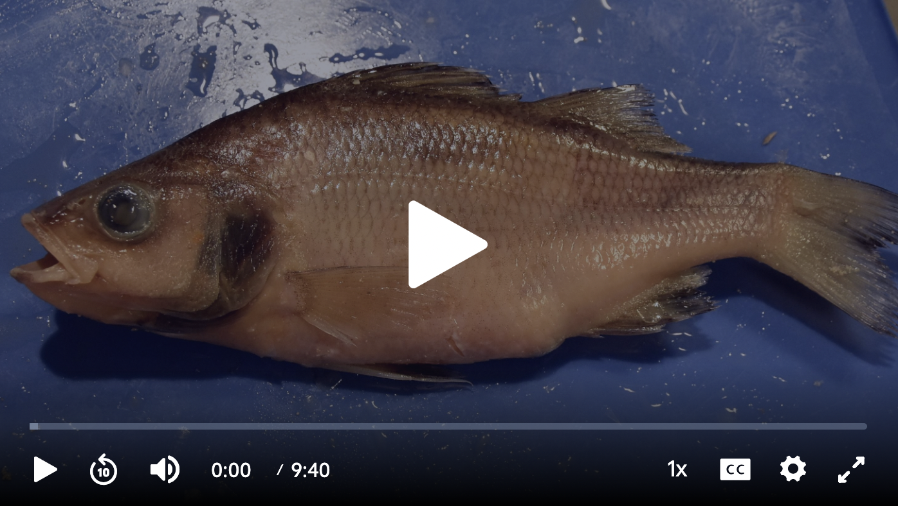

# (PART\*) Lab 6 {-}

# Animal Systems II: Part One {-}

*Last updated `r Sys.Date()`*

### Overview of the Week {-}

1. You will be joining your lab mates and TA during your regular scheduled time but online
2. Your TA will go through a PowerPoint presentation online
3. You will be given time to review all material provided on Canvas
4. You must complete all quizzes for this week's lab provided on Canvas due **before 11:59 pm on July 25th**
5. Submit your final recommendation report Assignment #3 **before 11:59pm on July 28th** 

This week you will be working your way through the material posted on Canvas online but during your scheduled lab time. Your TA will spend time going over a quick [PowerPoint presentation](https://osf.io/download/cf6tb) regarding these animals.  You will then need to spend a fair bit of time going through the different videos, images, and written material provided to ensure you have a solid grasp of these animals before coming to campus next week for your synchronous week. You must complete all quizzes associated with the animals found in animal systems II **before 11:59 pm on July 27th**.  Even though you will be getting together this week there is no reason you can't start reviewing all this information ahead of time so that you are better prepared to get through the material during your lab section. 

# Animal Systems Information II {-}

### Phylum Echinodermata {-}

*Biology 125 Biology for Science Majors II Lab Manual. Written by Dr. Tristyn Hay October, 2021. Some content provided by the University of British Columbia and Okanagan Biology Graduate Program students handbook The Fictional Animal Project: A Tool for Helping Students Integrate Body Systems. Adv. Physiol. Edu 41: 239-243 Blatch et al. 2017*

A \“spiny skin\” characterizes members of the phylum Echinodermata, by only living in marine environments, and by possessing a unique water vascular system. The are also radially symmetrical as adults, but not as larvae. The spiny skin is actually an endoskeleton made up of calcareous plates. Typical echinoderms include seastars (starfish), brittle stars, sea urchins, sand dollars, sea cucumbers and sea lilies.  According to DNA evidence, they are closely related to members of the Phylum Chordata, the phylum to which humans belong. Chordates andechinoderms also share a similar pattern of embryonic development, as both are deuterostomes.  
  
**EXTERNAL FEATURES OF THE SEASTAR**

Pisaster can be seen in the crevices of intertidal rocks and covering the pilings of piers and docks. Pisaster is a rapacious predator on bivalves, but little eats it, except for the occasional desperate seagull.  
 
The underside of the seastar is referred to as the oral side; the opposite side is the aboral side. The external features on the aboral side include the rays (arms) and sieve plate (madreporite). On the surface there are small calcareous bumps called spines and between them arestructures called dermal papillae (not visible with the naked eye). On the mouth side tube feet, the mouth and ambulacral groove can be observed. 

The sea star uses its water vascular system to capture food and in locomotion and respiration. Water enters the system via the sieve plate.  The water is then moved along through a series of canals by the action of cilia out to the rays and to the ampullae. Contraction of an ampulla forces water into a tube foot lengthening it. Contraction of longitudinal muscles in the foot forces water back into the ampulla shortening the foot. Small suction discs at the end of the feet allow the starfish to move on hard ground and to grasp its prey. The tube feet are also important sites of gas exchange. Pressure generated by the water vascular system also allows the seastar to evert its cardiac stomach and pry open the shells of bivalves like clams, in order to eat them. It is important to realize that the water vascular system is not a true a vascular system supplied with a heart as a pump, and that there is no blood that contains special pigments for transporting gases (as is seen in other animals with true vascular systems). [Video of tube feet in action](http://www.youtube.com/watch?v=p0VM67cQUWw&feature=related)
 
**DIGESTION**

Seastars feed by everting part of the cardiac stomach through their mouths out into the water (or even directly into the shells of molluscs).  Then the food is either brought back into the body of the seastar for digestion or digested in place outside the seastar’s body.  This allows it to feed on animals much larger than itself. Without being able to evert one of its stomachs, the hard endoskeleton would limit the size of prey that could be eaten by the seastar. The cardiac stomach passes the food to the pyloric stomach, where more digestion takes place. Most of the space in the ray is taken up by two highly branched digestive glands (also called pyloric caeca). They secrete digestive juices from their many lobes. They are connected to the pyloric stomach by a pyloric duct in each ray. Absorption of nutrients occurs in the digestive glands.   
 
 
**TRANSPORT AND EXCHANGE**

Gas exchange occurs through two types of structures that extend from the surface of the seastar: the tube feet and the papillae (also called papulae or gills); the latter are thin-walled extensions of the body cavity (coelom) that extend onto the aboral surface of the seastar. They look like small finger-like sacs when the animal is in the water, but may not be visible on these specimens. There is no circulatory system in the seastar. Instead, gases are carried around the body via fluids in the body cavity, powered by the action of cilia. 
 
In one ray the digestive glands have been removed to show the ampullae of the tube feet, which are the bulbs on the aboral side of the tube feet, which contract to extend the tube feet.  
 
**EXCRETION AND OSMOREGULATION**

In seastars, nitrogenous waste is excreted as ammonia. Solid waste is expelled through the anus. There is no osmoregulation in seastars. They are osmoconformers. 
 
**REPRODUCTION**

Sometimes individual animals are male or female (dioecious).  In other cases, the same gonadcan produce both eggs and sperm, either simultaneously or sequentially. External fertilization occurs after the gametes have been released through ducts located on the central body between the arms. 

### Phylum Chordata-Perch {-}

Phylum  Chordata  includes  all  those  animals  (perhaps  50,000  species)  with  backbones:  fish, 
amphibians,  mammals,  reptiles,  birds,  as  well  as  a  few  other  species.  A  few  chordates  do  not have  backbones  and  are  thus  classified  as  invertebrates.  These  include  small  marine animals called tunicates and lancelets.  To be a chordate an animal must:  

1. Have had at least during embryonic development, a structure called a notochord. (this is a  flexible  supportive  rod  running  longitudinally  through  the  dorsum  of  the  animal  just ventral to the nerve cord; it becomes the spinal column in vertebrates);  
2. have pharyngeal gill slits at some stage in their development; 
3. have a dorsal hollow nerve cord, and 
4. Have a post-anal tail. 
 
The perch is a chordate belonging to the Actinopterygii (ray-finned fishes) within the subphylum Vertebrata. Well  over  25,000  ray-finned fish  species  are  known  today  and,  as  we  probe deep ocean regions, we will find many more.  Perch are freshwater food and game fish found in Europe 
and  North  America.  Perca  fluviatilis  or  yellow perch  is  a  marginal  sport  fish,  which  has  been introduced into Vaseux and Osoyoos Lakes in the Okanagan.  
 
**THE PERCH – EXTERNAL FEATURES**

Be sure that you can identify the dorsal and ventral sides of your specimen and its anterior and 
posterior ends.  Be able to draw and identify the pectoral, dorsal, pelvic, anal, and caudal fins.  
Most  fish  have  external fertilization,  but  a  few  species, like  guppies,  have  internal fertilization and are livebearers. 
 
**DIGESTION**

Perch are carnivores. Their digestive tract comprises an alimentary canal (the tube running from the  mouth  to  the  anus)  as  well  as  accessory  structures,  such  as  the  liver,  salivary  glands and pancreas.  After  the  mouth,  the  alimentary  canal  includes,  in  order,  the  esophagus,  stomach, pyloric caeca (secretory and digestive functions), intestine and duodenum. 
 
**CIRCULATION AND RESPIRATION**

Perch, being aquatic chordates, use gills as a respiratory exchange surface. Cut away the bony 
operculum  to  expose  the  gill  chamber  and  its  four  gills.  Remove  an  individual  gill  to  study its structure. The hard-bony support is the gill arch, with posteriorly directed gill filaments. The hard-anterior  finger-like  projections,  the  gill  rakers,  prevent  coarse  material  or  food  from  passing through the gill slits.  Gill filaments are supplied with capillary beds across which gas exchange occurs.  The flow of blood is opposite to the flow of water across the gills, called counter-current flow;  this  enhances  the  concentration  gradient  and  thus  the  rate  of  diffusion. This  helps metabolically active fish to more efficiently extract oxygen from relatively poorly (relative to air) oxygenated water.  

Chordates have closed circulatory systems. The advantage of a closed circulatory system over an open system is that blood can be kept at a higher pressure thus moving through the body more quickly, which is more efficient at servicing body tissues. 
 
The pericardial cavity, just beneath and ventral to the gills, contains the two-chambered heart. Observe the thin-walled posterior atrium extending over the thicker-walled ventricle. Anterior to the ventricle is the bulbus arteriosus, the enlarged base of the ventral aorta that carries blood to the gills and on to the rest of the body. The blood is under pressure when it reaches the gills, but pressure is reduced when the blood passes through the capillary bed.  Blood pressure remains low as the blood travels to the rest of the body.  This is different from animals with a pulmonary loop,  in  which  the  blood travels  back  from  the  lungs  to  the  heart,  where  it  is  pumped  (re-pressurized)  to  the  rest  of  the  body  and  thus  can move  more  quickly  and service body  tissues more efficiently than the lower pressure system. 
 
**EXCRETION AND OSMOREGULATION**

Chordates have kidneys composed of nephrons. In fish and amphibians, the kidneys lie as two straps alongside the spinal column; in reptiles they become attenuated to the posterior portion of  the  animal,  and  this  phenomenon  is  even  more  advance  in  birds  and  mammals. Kidneys function  as  both  excretory  and  osmoregulatory  organs.  In  addition, osmoregulation  can  be facilitated by other organs, depending upon the type of animal. 
 
In freshwater fish like the perch, the kidney excretes large amounts of dilute urine in order to rid the body of excess water. In marine fish, the kidney excretes salt ions in very concentrated urine. 
In all fish, ammonium is the form of nitrogenous waste excreted. 

### Phylum Chordata-Rat {-}

Rats are examples of terrestrial chordates. They are also mammals.  Therefore, their anatomy will reflect the fact that they get their oxygen from air, must conserve water, and have internal fertilization with their offspring then developing in a uterus before being born. 
 
**DIGESTION**

As in all tetrapods, the anterior end of the digestive and respiratory systems is shared.  Air, water and food all pass through the oral cavity.  In the pharynx, the epiglottis acts as a gate to direct air into the lungs and food or water into the rest of alimentary canal.  Like in the perch, the digestive 
system comprises the alimentary canal (oral cavity, pharynx, esophagus, stomach, small intestine, large intestine, rectum and anus). Each part of the alimentary canal is specialized for a particular  function:  mechanical  or  chemical  digestion,  absorption  of  water  or  nutrients,  or retention  or  elimination  of  undigested  solid  wastes. Be  able  to  identify  the  stomach,  small intestine, salivary glands, liver, and spleen in preparation for your lab exam. 
 
The  accessory  structures  of  the  digestive  tract include  the  liver,  pancreas  and  salivary glands. These are exocrine glands, meaning that they secrete chemicals into ducts that lead directly to another structure - in this case, the alimentary canal specifically, the accessory structures supply  enzymes, or other chemicals that aid in digestion, to the alimentary canal. 
 
**CIRCULATION AND REGULATION**

After  being  directed  from  the  pharynx  into  the  respiratory  system,  air  enters  the  trachea,  the bronchi  and  then  the  lungs.  The  lungs  of  amphibians  are  fairly  simple  invaginated  sacs  of vascularized epithelial tissue in which there are internal partitions to increase the surface area.  Birds  and  mammals,  however,  have  lungs  of  a more  complex  nature. In  mammals,  the bronchioles  divide  into  finer  and  finer  branches  until they  end  in  tiny,  blind-ended  sacs  called alveoli, which  greatly  increase  the surface  area  across  which  gas  exchange  occurs. Birds  have 
other mechanisms to increase gas exchange. 
 
Because  air  movement  into  and  out  of  the  lungs  is  based  on  differences  in  air  pressure, it  is important that the lungs be sealed in an air-tight part of the body where movement of muscles 
can create differences in pressure.  This area is called the thoracic cavity.  Differences in pressure 
within the thoracic cavity are created by movement of muscles associated with the ribs, as well as the diaphragm. 
 
The heart of the rat, like all mammals, consists of four chambers: two atria and two ventricles. When  the  atria  contract  they  fill  their  respective  ventricle  with  blood;  when  the  ventricles contract, the increased pressure directs blood from the right ventricle to the lungs and from the left ventricle to the rest of the body.  Your rat has been double-injected with latex. Blue latex was injected into the veins and red latex was injected into the arteries. Entering the right atrium are three main blood vessels that bring the deoxygenated blood back to the heart from all regions of the body. These blood vessels are the right superior vena cava, the left superior vena cava and the inferior vena cava.  The right and left superior venae cavae return deoxygenated blood to the heart from the right and left side of the head, neck and forelimbs.  The inferior vena cava returns deoxygenated  blood  to  the  heart  from  the  lower  part  of  the  body. More  in  depth  detail  of  a mammal heart will be covered in the next lab. 
 
**EXCRETION AND OSMOREGULATION**

Rat  kidneys,  like  those  of  humans,  excrete  urea.  Urea  is  less  toxic  than  ammonia  therefore  it requires less water to be excreted; however, energy must be expended in order to  make urea from ammonia.  Organisms that use urea tend to live in environments where water conservation 
is important. Rat  kidneys  lie  outside  of  the  abdominal  cavity,  behind  the  lining  of  connective tissue. Thus,  they  are  said  to  be  retroperitoneal. The  kidneys  are  the  major  osmoregulatory organ in the rat. 
 
**REPRODUCTION**

In male rats, the scrotum, a large sac of skin, muscle and connective tissue holds the testes on 
the exterior of the body just ventral to the anus.  During non-breeding periods, the testes may be retracted into the abdominal cavity and the scrotum will not be enlarged.  Around the outside of each testis is a C-shaped structure known as the epididymis, which is a very long, highly coiled 
tubule.  Part of the epididymis is on the posterior end of the testes and part is on the anterior end.  Sperm cells produced in the seminiferous tubules of the testes pass into the epididymis and then into the vas deferens, which is a moderately large tube leading from the epididymis to the urethra, which is a tube located inside the penis. The penis is enclosed in an epithelial sheath and held along the ventral wall of the abdomen.  
 
The  prostate  glands  are  found  on  either  side  of  the  urinary  bladder.   These  glands,  and  some other  glands  in  this  region,  comprise  the  accessory  sex  glands.   The  secretions  of  these  glands form the seminal fluid, which carries the sperm during ejaculation, activates and provides certain nutrients for them, and contains substances that neutralize the somewhat acid environment in 
the vagina.    
 
In female rats, as in all mammals, the eggs are produced in the ovaries and then released into the 
oviducts, through which they travel to the uterus.  If fertilization occurs, the fetuses develop in the uterus. The rat uterus has two horns, which join at their base to form the vagina. 

# Life Cycles, Dissection Guides, & Videos {-}

### Phylum Echinodermata {-}

Did you know that a seastar eats with its stomach outside itself? Click the video below to see for yourself! [https://www.shapeoflife.org/video/echinoderms-sea-star-time-lapse-eating-mussel](https://www.shapeoflife.org/video/echinoderms-sea-star-time-lapse-eating-mussel)

**Seastar Life Cycle**

**Seastar Dissection Guide & Video**

Click [here](https://osf.io/download/y89wz) to download a copy of the Seastar Dissection Guide.

**Seastar Quiz**

Complete the Seastar Quiz on [Canvas](https://canvas.ubc.ca/).

### Phylum Chordata-Perch {-}

Ribbons aren't just for presents! Perch lay their eggs in the form of ribbons. 

Click [here](https://www.youtube.com/watch?v=T7xXfhOjtsU) to see more!

**Perch Life Cycle**

**Perch Dissection Guide & Video**

Click [here](https://osf.io/download/hbkw9) to download a copy of the Perch Dissection Guide.

**Perch Quiz**

Complete the Perch Quiz on [Canvas](https://canvas.ubc.ca/).

### Phylum Chordata-Rat {-}

Rats can swim! And apparently climb up your toilet. Click [here](https://www.nationalgeographic.com/) to check it out!

**Rat Life Cycle**

**Rat Dissection Guide & Video**

Click [here](https://osf.io/download/72ztx) to download a copy of the Rat Dissection Guide.

**Rat Quiz**

Complete the Rat Quiz on [Canvas](https://canvas.ubc.ca/).