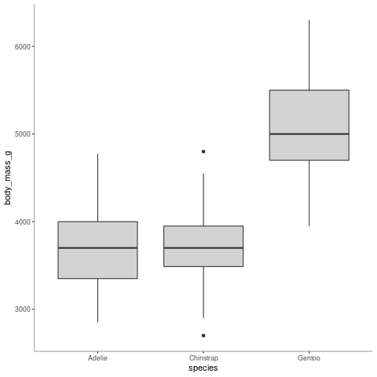

# Data Availability Statement

Data is available as a supplementary file in `.csv` format.

# Introduction

Your introduction should situate, explain, and identify your research project. It should do this by providing relevant background information that frames the current project and is directly relevant. It should then identify the importance of this particular project. And finally it should clearly articulate the research question and hypothesis being addressed.

# Methods

Remember, for transparency and reproducibility, your methods are key to your audience understanding how you did exactly what you did. And if you wrote a protocol, it is the methods section against which that protocol will be screened to identify bias.

So, it should be clear, concise, and contain sufficient information for someone else to reproduce the experiment. This means it should include things like, how specimens were procured, how data was collected (tools, measurements etc), and how the data was analysed.

{width=50%}

The steps should flow logically, and, while being concise, you should not use bullet points.

# Results

Your results section should clearly outline the relevant findings from your study and should flow directly from your research question and hypothesis.

This section should include graphs or figures to highlight key findings. Graphs and figures should be present immediately following paragraphs describing the results described by these graphs and figures.

While summary data should be provided, raw data should be not; raw data should be included as supplementary content.

# Discussion & Recommendations

Your job here is to try and explain what you found and how it relates to what others have found. From here you will make your recommendation to your client.

\clearpage

# References

At least 3 primary source papers should be listed.

For formatting guidance, refer to the [APA section](https://ubco-biology.github.io/Procedures-and-Guidelines/apa-citations.html) of the BIOL Procedures and Guidelines.